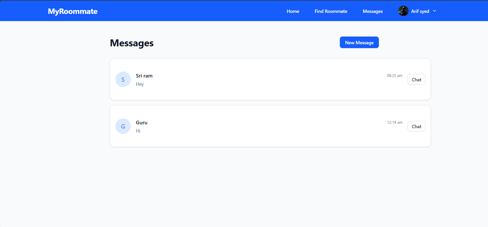

Sure! Below is the complete **markdown code** you can copy and paste into a file like `README.md`:

```markdown
# MyRoommate

A full-stack matchmaking web app for students to find ideal roommates based on lifestyle preferences and chat with them in real-time.

🔗 [Live App](https://my-roommate-zeta.vercel.app/)  
📂 [GitHub Repository](https://github.com/sdarif981/MyRoommate)

---

## ✨ Features

- 🧠 Intelligent matching algorithm using habits, college, and lifestyle data.
- 🔍 Filter users by noise tolerance, sleep patterns, cleanliness, etc.
- 💬 Real-time messaging using Socket.io.
- 👤 Personalized user profiles with match scoring.
- ⚡ Fast, responsive UI built with modern stack.

---

## 🛠 Tech Stack

- **Frontend:** React + Vite, Tailwind CSS, Redux Toolkit
- **Backend:** Node.js, Express.js
- **Real-Time Messaging:** Socket.io
- **Deployment:** Vercel (Frontend), Render (Backend)

---

## 📁 Project Structure

```

MyRoommate/
├── backend/          # Node.js server (Render deployment)
├── frontend/         # React client (Vercel deployment)
└── README.md

````

---

## ⚙️ Getting Started Locally

### 1. Clone the Repository

```bash
git clone https://github.com/sdarif981/MyRoommate.git
cd MyRoommate
````

---

### 2. Start Backend Server

```bash
cd backend
npm install
nodemon server.js
```

Make sure your backend runs at `http://localhost:5000` (or update the port if changed in the code).

---

### 3. Configure Frontend

In the file `frontend/src/constants/constant.js`, change the API URLs for local development:

```js
// For local development
export const USER_API = "http://localhost:5000/api/user";
export const MESSAGE_API = "http://localhost:5000/api/message";
```

---

### 4. Run Frontend

```bash
cd frontend
npm install
npm run dev
```

The frontend will start at `http://localhost:5173`.

---

## 🧠 What I Learned

* Managing global state with Redux Toolkit
* Styling and layout using Tailwind CSS
* Implementing WebSocket-based chat using Socket.io
* Handling API integration and environment-specific configs
* Deploying full-stack apps using Vercel and Render

---

## 📸 Screenshots

### Homepage


### Search & Match Filters


### Messages



> *(Replace the image paths with your actual screenshot paths or links if hosted on GitHub)*

---

## 🚀 Deployment Links

* **Frontend (Vercel):** [https://my-roommate-zeta.vercel.app/](https://my-roommate-zeta.vercel.app/)
* **Backend (Render):** [https://myroommate.onrender.com/](https://myroommate.onrender.com/)

---

## 📌 Future Enhancements

* Authentication system with JWT
* Profile image uploads
* Email notifications
* Admin dashboard for moderation
* More accurate roommate match scoring

---

## 🙋‍♂️ Author

**Arif Syed**
GitHub: [@sdarif981](https://github.com/sdarif981)

```

You can now paste this into a text file named `README.md` and place it at the root of your GitHub project. Let me know if you want it saved to a file directly!
```
