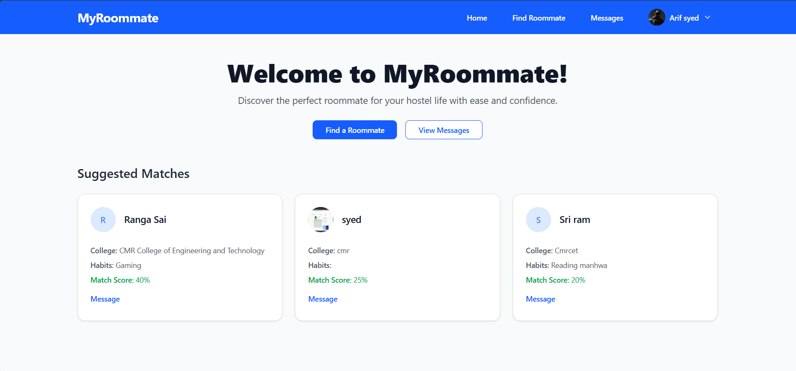
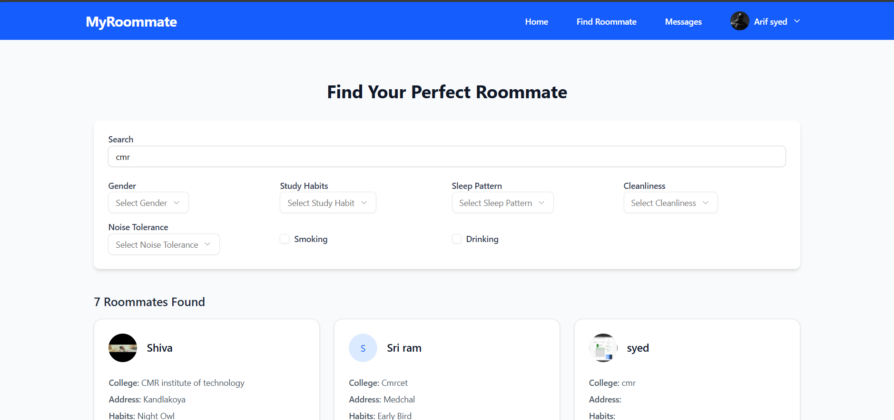
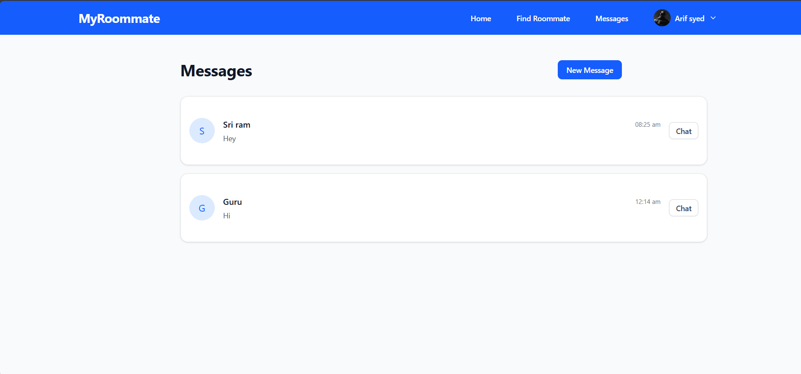

# MyRoommate

A full-stack matchmaking web app for students to find ideal roommates based on lifestyle preferences and chat with them in real-time.

🔗 [Live App](https://my-roommate-zeta.vercel.app/)  
📂 [GitHub Repository](https://github.com/sdarif981/MyRoommate)

---

## ✨ Features

- 🧠 Intelligent roommate matching algorithm using lifestyle and college preferences.
- 🔍 Advanced filtering (sleep patterns, cleanliness, noise tolerance, etc.).
- 👤 JWT-based user authentication (secure login & registration).
- 🖼️ Profile picture (DP) upload and display.
- 💬 Real-time chat between matched users (Socket.io).
- 📱 Fully responsive UI for mobile, tablet, and desktop.
- ⚡ Fast, modern performance with Vite and Tailwind CSS.

---

## 🛠 Tech Stack

- **Frontend:** React + Vite, Tailwind CSS, Redux Toolkit, Axios
- **Backend:** Node.js, Express.js, MongoDB, Cloudinary, Multer
- **Authentication:** JSON Web Tokens (JWT)
- **Real-Time Messaging:** Socket.io
- **Deployment:** Vercel (Frontend), Render (Backend)

---

## 📁 Project Structure

```
roomate/
├── backend/
│   ├── controllers/           # Message & user logic
│   ├── middleware/            # Auth handling
│   ├── models/                # MongoDB schemas
│   ├── routes/                # Express routes
│   ├── utils/                 # Cloudinary, DB, multer
│   ├── server.js              # Main backend server      # 
│   ├── .env
│   ├── .gitignore
│   └── package.json
│
├── frontend/
│   ├── public/                # Static assets
│   └── src/
│       ├── assets/            # SVGs and logos
│       ├── components/
│       │   ├── ui/            # UI components (button, input, etc.)
│       │   ├── DialogBox.jsx
│       │   ├── Footer.jsx
│       │   └── Navbar.jsx
│       ├── constants/         # Global constants
│       ├── lib/               # Utility functions
│       ├── pages/             # Page components
│       ├── redux/             # State slices & store
│       ├── App.jsx
│       ├── main.jsx
│       └── index.css
│   ├── vite.config.js
│   ├── vercel.json
│   ├── .gitignore
│   └── package.json
│
└── Readme.md
```

---

## ⚙️ Getting Started Locally

### 1. Clone the Repository

```bash
git clone https://github.com/sdarif981/MyRoommate.git
cd MyRoommate
```

---

### 2. Start Backend Server

```bash
cd backend
npm install
nodemon server.js
```

Make sure your backend runs at `http://localhost:5000`.

---

### 3. Configure Frontend

In `frontend/src/constants/constant.js`, switch API URLs for local development:

```js
// For local development
export const USER_API = "http://localhost:5000/api/user";
export const MESSAGE_API = "http://localhost:5000/api/message";
```

---

### 4. Run Frontend

```bash
cd frontend
npm install
npm run dev
```

App will run at: `http://localhost:5173`

---

## 🧠 What I Learned

- JWT-based authentication and secure routing
- Global state management with Redux Toolkit
- Building fully responsive layouts with Tailwind CSS
- Real-time chat using Socket.io
- Profile picture upload and media handling
- Deploying full-stack applications (Render + Vercel)

---

## 📸 Screenshots

### Homepage  


### Search & Filters  


### Messages  



---

## 🚀 Deployment Links

- **Frontend**: [Vercel](https://job-portal-xi-opal.vercel.app/)
- **Backend**: [Render](https://job-portal-1-m0br.onrender.com)

---

## 📌 Future Enhancements

- Email notifications and reminders
- Admin dashboard for reporting/moderation
- Improved match score logic with ML-based suggestions
- In-app alerts and messaging notifications

---

## 🙋‍♂️ Author

**Arif Syed**

- 📧 [Email](mailto:sdarif981@gmail.com)  
- 🧑‍💻 [GitHub](https://github.com/sdarif981)

---

## 📄 License

This project currently does **not** include an open-source license.  
You may use it for learning purposes only. For commercial or production use, please contact the author.

---

> 🚧 This is an actively developed project. Suggestions and improvements are welcome!